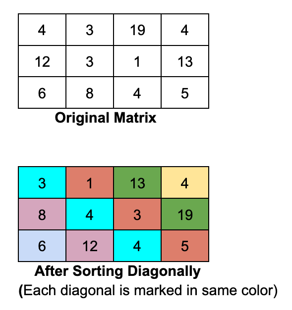

# Sort Matrix Diagonally
```
Given a N x M matrix, sort its elements diagonally. For eg. see the following matrix and its diagonal sorting:



Input Format
The first line of input will contain two space separated integers N and M,denoting the no. of rows and columns in the input matrix.
Next N lines contains M space separated integers, the elements of the matrix.

Output Format
Output N lines, each containing M space separated integers, the elements of diagonally sorted matrix.

Constraints
1 ≤ N,M ≤ 100

The elements of the matrix are non-negative and won't exceed 1000.
```
### Examples : 
```
Input:
3 3
3 1 5
8 2 1
4 6 0

Output:
0 1 5
6 2 1
4 8 3
```

## Instructions
1. Write your solution in `task.py`
2. Do NOT modify `test_task.py`
3. Run tests locally before pushing

## Submission Rules
- Only `task.py` will be evaluated
